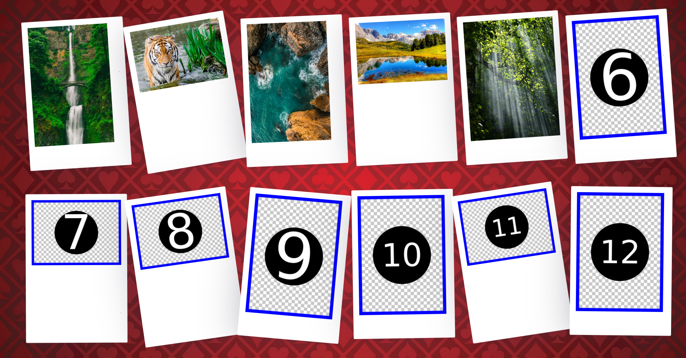

# Polaroid style photo deck



A beautiful polaroid style photo deck.
_See [demo](https://ikefakis.github.io/react-polaroid-photo-deck)_

### Getting Started

You can now run the photo
1. `$ cd photobooth` - go inside the project directory
2. `$ npm install` - install dependencies
3. Start the Node server
```bash
npm start
```
you will be navigated to [http://localhost:3000](http://localhost:3000) on your browser with hot reloading. or using the `ip a` to get the ip

On another terminal open the image server that will be responsible for the transit of the `POST` and `GET` request.

/!\ /!\ If you see some post request without any `npm start` that means port `:3000`, is still open in some page.
Make sure you close every html page of the react app before starting the last version of the server (Even if restart should'nt be need) /!\ /!\ 

4. Open the server at 5000 for the image update infos transists `http://localhost:5000`
```bash
python scripts\image_server.py
```

### Run procedure

You can also run the full system procedure using the bash script that will open the 2 required terminals

```bash
./start_photobooth_canvas.sh
```


## OLD README Infos

### Getting Started

1. `$ cd react-polaroid-photo-deck` - go inside the project directory
2. `$ npm install` - install dependencies
3. `$ npm start` - you will be navigated to [http://localhost:3000](http://localhost:3000) on your browser with hot reloading.

### Customization

- Put your images in `public/img` folder and update the paths inside `photos.json` with orientation info: (portrait | landscape)

### Build

- `$ npm run build` - An optimized production build will be generated in `build` folder.

### Deploy

- `$ npm run deploy` - Deploy to github pages.
